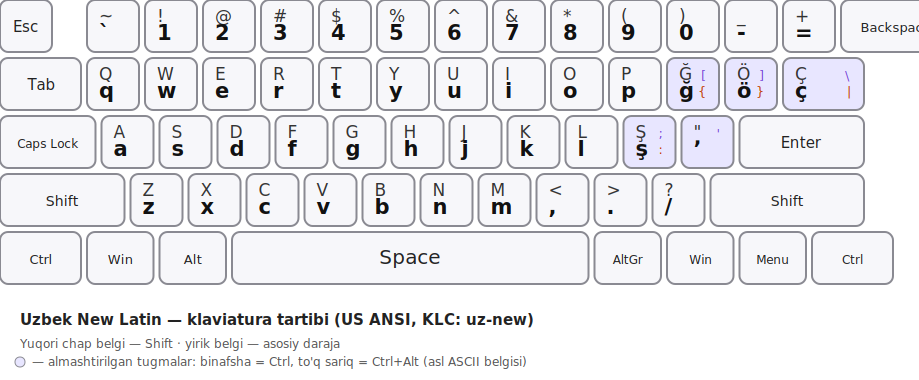

# Özbekça yangi klaviatura tartibi (Uzbek New Latin Keyboard Layout)

Bu repozitoriy özbek lotin alifbosidagi maxsus harflar (**ğ, ö, ş, ç**) uchun möljallangan Windows klaviatura tartibini öz ichiga oladi. Tartib standart QWERTY (ANSI) joylaşuviga asoslangan bölib, faqat 4 ta tugma özbekça harflarga moslaştirilgan — qolgan barcha tugmalar odatdagidek işlaydi.

## Nega kerak?

Rasmiy özbek lotin alifbosida `sh`, `ch`, `g'`, `o'` kabi digraflar (ikki belgidan iborat harflar) mavjud. Ushbu tartib ularning har birini bitta tugma bilan, bitta harf sifatida yoziş imkonini beradi:

| Digraf | Maxsus harf |
|:---:|:---:|
| `sh` | **ş** |
| `ch` | **ç** |
| `g'` | **ğ** |
| `o'` | **ö** |

## Nima özgargan?

Odatiy inglizcha (US) tartibdagi törtta belgi tugmasi özbekça harflarga almaştirilgan. Almaştirilgan asl belgilar yöqolib qolmagan — ular **Ctrl** va **Ctrl+Alt (AltGr)** qatlamlariga köçirilgan:

| Tugma (fizik joyi) | Oddiy | Shift | Ctrl | Ctrl+Alt |
|---|:---:|:---:|:---:|:---:|
| `[` örnida | **ğ** | **Ğ** | `[` | `{` |
| `]` örnida | **ö** | **Ö** | `]` | `}` |
| `;` örnida | **ş** | **Ş** | `;` | `:` |
| `\` örnida | **ç** | **Ç** | `\` | `\|` |

Qolgan barcha tugmalar (harflar, raqamlar, tiniş belgilari, `'`, `` ` `` va h.k.) standart US tartibi bilan bir xil işlaydi.

## Örnatish

1. [**Releases**](https://github.com/thisgeek13/uz-UZ-new/releases/latest) bölimiga öting va kompyuteringizga mos faylni yuklab oling:
   - **`setup.exe`** — asosiy örnatuvçi (köpçilik uçun tavsiya etiladi)
   - **`uz-new_amd64.msi`** — 64-bit Windows uçun
   - **`uz-new_i386.msi`** — 32-bit Windows uçun
2. Yuklab olingan faylni işga tuşiring va körsatmalarga amal qiling.
3. **Sozlamalar → Vaqt va til → Til → Klaviatura** bölimidan **"Uzbek new layout"** ni qöşing va faollaştiring.
4. Tillar örtasida almaştirish uçun odatdagi klavişlar kombinatsiyasidan (masalan `Win + Space` yoki `Alt + Shift`) foydalaning.

> Manba kod (`Uzbek-new.klc`) shu repozitoriyning asosiy qismida joylashgan — uni özingiz [Microsoft Keyboard Layout Creator (MSKLC)](https://www.microsoft.com/en-us/download/details.aspx?id=102134) yordamida tekshirib, özgartirib qayta tuzmoqçi bölsangiz, foydalanişingiz mumkin.

## Til va litsenziya

- **Til:** Özbek tili (lotin yozuvi), `uz-UZ` (LCID `00000443`)
- **Muallif:** thisgeek
- **Litsenziya:** © 2026 thisgeek

## Hissa qöşiş

Xatolik topsangiz yoki takliflaringiz bölsa — Issue oçing yoki Pull Request yuboring.
